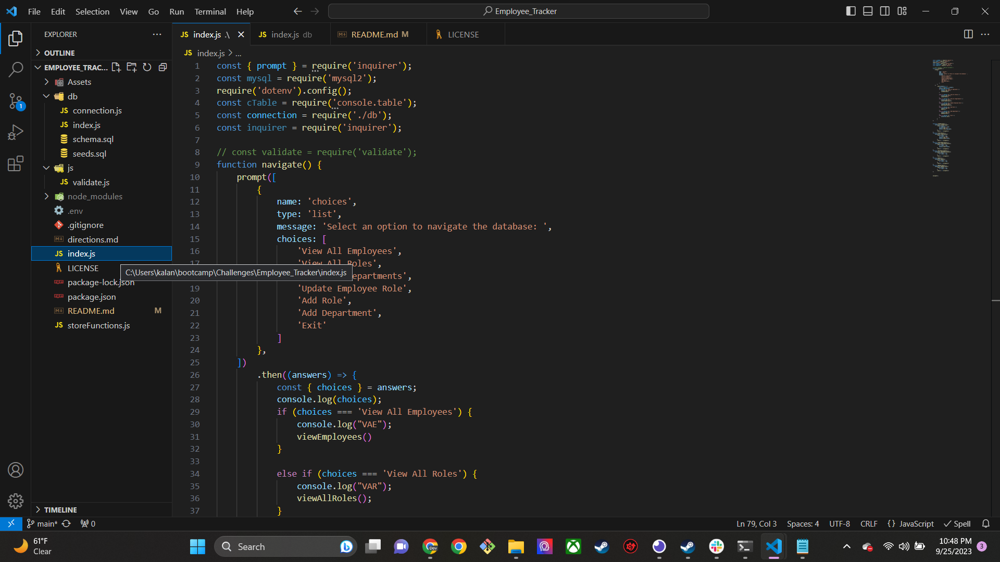
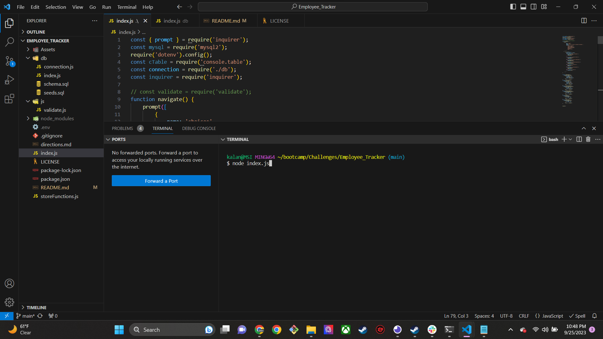
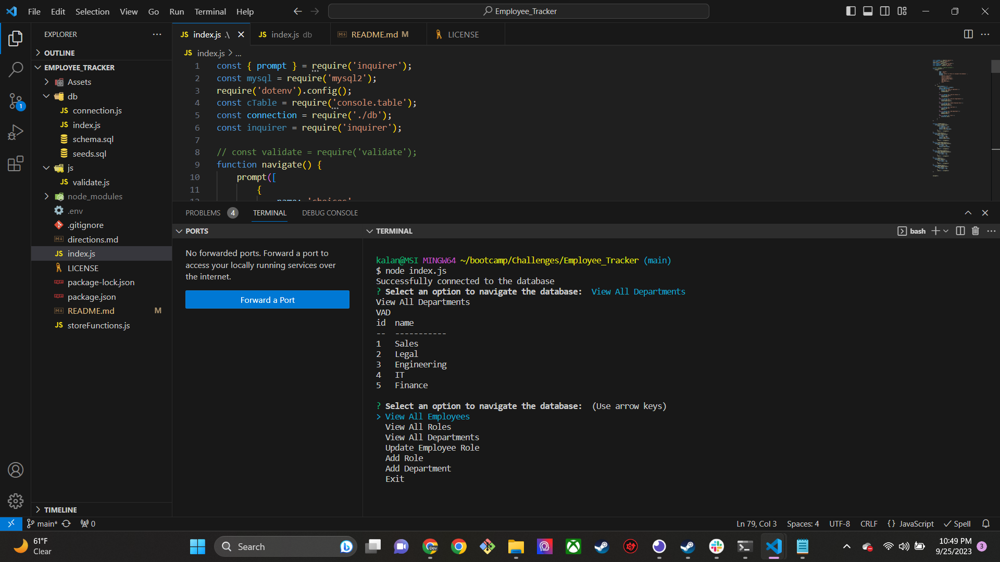

# Employee_Tracker

## Description

This challenge is the first one that I have not entirely finished. Wrestling with a error wasted a couple of days and left me with not enough time to finish. That's not to say, however, that I did not enjoy this challenge. Sql is a unique and powerful language, one that I look forward to exploring more in the future! 

RESUBMIT: I have dived back into the challenge, and totally have resigned my system. I started by greatly simplifying my file structure, making all sql commands come directly out of index.js, and the connection as well. I spent time researching sql commands to update my existing commands and finish those I had incomplete. 

## Table of Contents (Optional)

If your README is long, add a table of contents to make it easy for users to find what they need.

- [Installation](#installation)
- [Usage](#usage)
- [Credits](#credits)
- [License](#license)

## Installation

To run this application, you will need to install Node.js, and the NPM package.. Instructions on installing these packages can be found here: https://www.guru99.com/download-install-node-js.html

Once these are installed, enter "npm i" to installed related dependencies, Inquirer, console.table, dotenv, express, mysql2, validator.

Check package.json to ensure that all packages are present. 

## Usage

Once all necessary packages have been downloaded, right click on index.js in the sidebar. Find 'run in integrated terminal, and type in "node index.js" You will then be given several prompts from which to generate your readme. Once finished, the generated README will appear in the sidebar, within the "Develop" folder. There will be a separate README always present, this is the static README for this project, that you are now reading.

## Credits

Bring thanks to TAs George and Kirktley who helped me with an error that bugged me for over two days. 

Tutor Cody Junier.

## License

MIT License

Copyright (c) 2023 Kalani Jones

Permission is hereby granted, free of charge, to any person obtaining a copy
of this software and associated documentation files (the "Software"), to deal
in the Software without restriction, including without limitation the rights
to use, copy, modify, merge, publish, distribute, sublicense, and/or sell
copies of the Software, and to permit persons to whom the Software is
furnished to do so, subject to the following conditions:

The above copyright notice and this permission notice shall be included in all
copies or substantial portions of the Software.

THE SOFTWARE IS PROVIDED "AS IS", WITHOUT WARRANTY OF ANY KIND, EXPRESS OR
IMPLIED, INCLUDING BUT NOT LIMITED TO THE WARRANTIES OF MERCHANTABILITY,
FITNESS FOR A PARTICULAR PURPOSE AND NONINFRINGEMENT. IN NO EVENT SHALL THE
AUTHORS OR COPYRIGHT HOLDERS BE LIABLE FOR ANY CLAIM, DAMAGES OR OTHER
LIABILITY, WHETHER IN AN ACTION OF CONTRACT, TORT OR OTHERWISE, ARISING FROM,
OUT OF OR IN CONNECTION WITH THE SOFTWARE OR THE USE OR OTHER DEALINGS IN THE
SOFTWARE.

## How to Contribute

If you created an application or package and would like other developers to contribute to it, you can include guidelines for how to do so. The [Contributor Covenant](https://www.contributor-covenant.org/) is an industry standard, but you can always write your own if you'd prefer.

